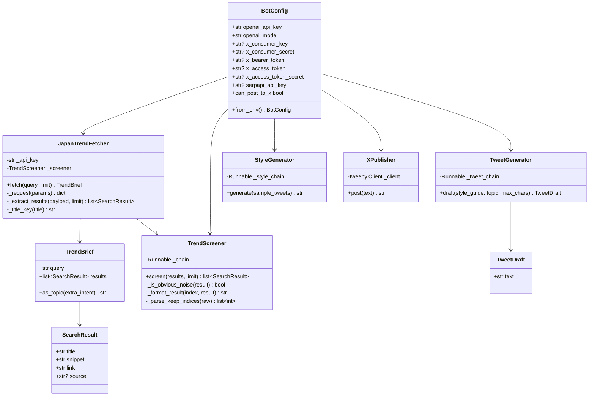
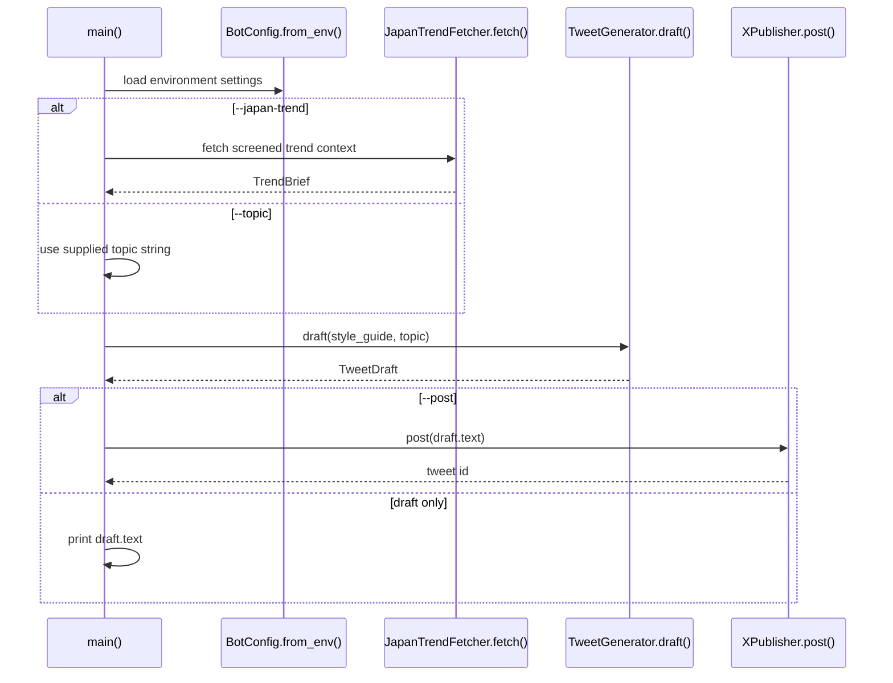
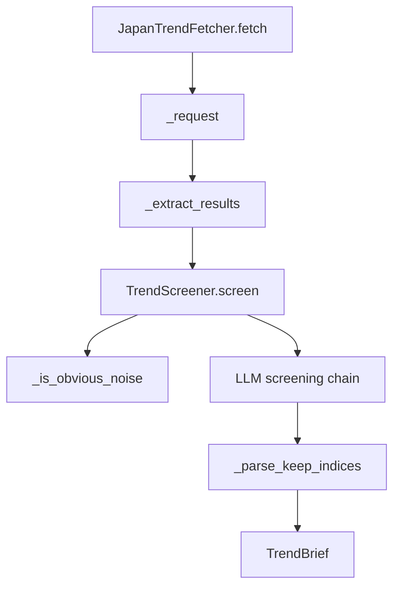
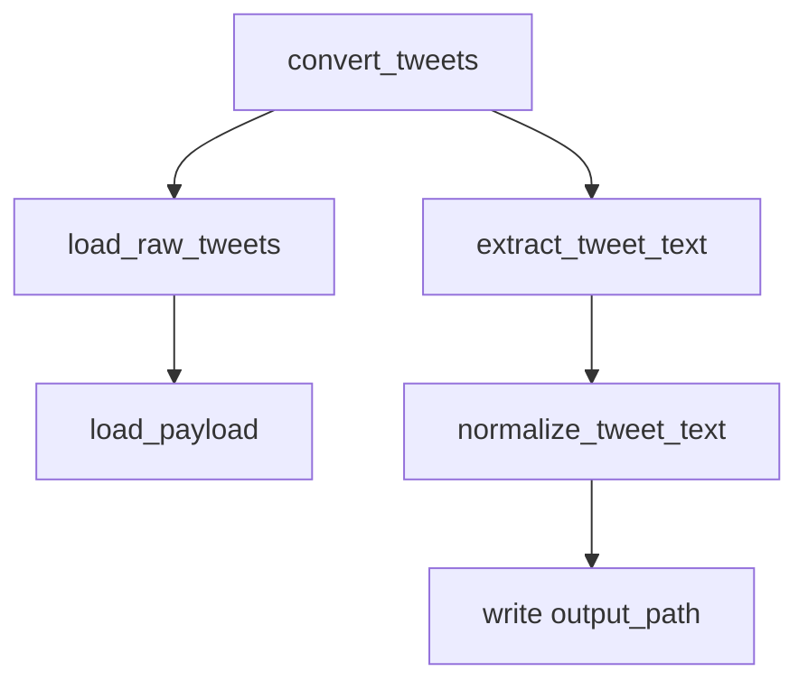

# Code Architecture

This document describes the structure of the main modules, classes, and
functions in the tweet bot.

## Module Map

```mermaid
flowchart TD
    main[main.py]
    config[twitter_bot.config]
    trends[twitter_bot.trends]
    generator[twitter_bot.generator]
    publisher[twitter_bot.publisher]
    style[twitter_bot.style]
    samples[twitter_bot.samples]
    convert[twitter_bot.convert_samples]

    main --> config
    main --> trends
    main --> generator
    main --> publisher
    style --> config
    style --> samples
    generator --> config
    publisher --> config
    trends --> config
```

## Runtime Classes



## Main CLI

`main.py`

| Function | Purpose |
| --- | --- |
| `build_parser()` | Defines CLI flags: `--style-guide`, `--topic`, `--japan-trend`, `--trend-query`, `--trend-results`, `--max-chars`, and `--post`. |
| `main()` | Loads `.env`, builds `BotConfig`, reads the style guide, resolves topic context, drafts a tweet, and either prints or posts it. |

Call relationship:



## Configuration

`twitter_bot/config.py`

| Symbol | Type | Purpose |
| --- | --- | --- |
| `BotConfig` | dataclass | Central runtime settings object. |
| `BotConfig.from_env()` | classmethod | Reads `OPENAI_API_KEY`, `OPENAI_MODEL`, SerpAPI key, and X/Twitter credentials from environment variables. |
| `BotConfig.can_post_to_x` | property | Returns true when the required user-context X posting credentials are present. |

## Trend Fetching And Screening

`twitter_bot/trends.py`

| Symbol | Type | Purpose |
| --- | --- | --- |
| `SearchResult` | dataclass | Normalized Google News result. |
| `TrendBrief` | dataclass | Holds the original query and screened results. `as_topic()` formats them for tweet generation. |
| `JapanTrendFetcher` | class | Fetches Google News results via SerpAPI and delegates screening. |
| `JapanTrendFetcher.fetch()` | method | Public entry point. Validates limit, calls SerpAPI, extracts candidates, screens them, and returns `TrendBrief`. |
| `JapanTrendFetcher._request()` | method | Performs the SerpAPI HTTP request with `urllib.request.urlopen`. |
| `JapanTrendFetcher._extract_results()` | method | Converts `news_results` into `SearchResult` objects and deduplicates by cleaned title. |
| `JapanTrendFetcher._title_key()` | method | Removes source suffixes like `｜ media` before duplicate comparison. |
| `TrendScreener` | class | Filters candidate news items before they become tweet context. |
| `TrendScreener.screen()` | method | Applies hard noise filtering, then asks the LLM screening chain which items to keep. |
| `TrendScreener._is_obvious_noise()` | method | Rejects obvious market/newswire noise using `MARKET_NOISE_PATTERN`. |
| `TrendScreener._format_result()` | method | Formats a result for the screening prompt. |
| `TrendScreener._parse_keep_indices()` | method | Parses the screener JSON response, accepting `{"keep_indices": [...]}`. |

Trend class flow:



## Tweet Generation

`twitter_bot/generator.py`

| Symbol | Type | Purpose |
| --- | --- | --- |
| `TWEET_PROMPT` | `ChatPromptTemplate` | System/human prompt that instructs the model to write an original Japanese tweet under the character limit. |
| `TweetDraft` | dataclass | Return object containing final draft text. |
| `TweetGenerator` | class | Builds a LangChain pipeline from prompt to `ChatOpenAI` to `StrOutputParser`. |
| `TweetGenerator.draft()` | method | Validates inputs, invokes the chain, strips output, and truncates to `max_chars`. |

## Style Generation

`twitter_bot/style.py`

| Symbol | Type | Purpose |
| --- | --- | --- |
| `STYLE_PROMPT` | `ChatPromptTemplate` | Japanese prompt for extracting reusable style traits from sample tweets. |
| `StyleGenerator` | class | Builds the LangChain style-analysis chain. |
| `StyleGenerator.generate()` | method | Validates sample tweets and returns a style guide string. |
| `build_parser()` | function | Defines CLI flags for style guide generation. |
| `main()` | function | Loads `.env`, reads sample tweets, generates a style guide, and writes or prints it. |

## Sample Loading

`twitter_bot/samples.py`

| Symbol | Type | Purpose |
| --- | --- | --- |
| `load_sample_tweets(path)` | function | Reads newline-delimited tweets, strips blanks and comments, and returns a non-empty list. |

## X Archive Conversion

`twitter_bot/convert_samples.py`

| Symbol | Type | Purpose |
| --- | --- | --- |
| `normalize_tweet_text(text, keep_urls)` | function | HTML-unescapes text, optionally removes URLs, normalizes whitespace. |
| `load_payload(path)` | function | Loads plain JSON or X archive JavaScript assignment files such as `tweets.js`. |
| `load_raw_tweets(path)` | function | Supports X API `{"data": [...]}`, raw list JSON, and X archive arrays. |
| `extract_tweet_text(tweet)` | function | Extracts `text` or `full_text`, including nested archive `tweet` objects, and skips retweets. |
| `convert_tweets(...)` | function | Converts raw tweets into unique newline-delimited samples and writes the output file. |
| `build_parser()` | function | Defines CLI flags for conversion. |
| `main()` | function | Runs conversion from CLI arguments. |

Conversion function flow:



## Publishing

`twitter_bot/publisher.py`

| Symbol | Type | Purpose |
| --- | --- | --- |
| `XPublisher` | class | Creates a Tweepy client if posting credentials are complete. |
| `XPublisher.post(text)` | method | Calls `create_tweet`; wraps X `Forbidden` errors with a credential-scope explanation. |

## Data Objects

The code uses a small set of explicit data objects:

| Object | Defined In | Used By |
| --- | --- | --- |
| `BotConfig` | `config.py` | All OpenAI, SerpAPI, and X-facing classes. |
| `SearchResult` | `trends.py` | Trend fetcher, screener, and trend brief formatter. |
| `TrendBrief` | `trends.py` | `main.py` passes its `as_topic()` output to `TweetGenerator`. |
| `TweetDraft` | `generator.py` | `main.py` prints or posts `TweetDraft.text`. |
